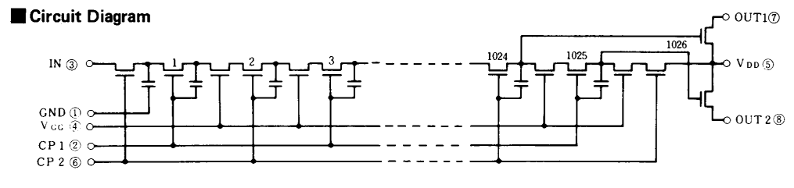

 
# Note:
The GDSII file is from the R2R DAC project.

# Bucket Brigade - Analog Delay

## Inspiration

[Philips Technical Review](https://www.worldradiohistory.com/Archive-Company-Publications/Philips-Technical-Review/70s/Philips-Technical-Review-1970.pdf)

Articles on page 97 and 266 describe a device (Fig 18) with 52 capacitors on a 1.2 x 1.8 mm die, circa 1970.

[Wikipedia](https://en.wikipedia.org/wiki/Bucket-brigade_device)

## Stretch Goal

Build a (rare) crunchy analog delay for a guitar effects pedal.

## Challenges

Intend to use a capacitor primitive. The MiM capacitor model for L3/L4 indicates 0.0022 pF/um^2. The TT8 analog area is 160 x 225 um, yielding 36 capacitors (2.2 pF). This will be reduced by 50% for the OpenLane2 digital area.

Simulation is needed to learn if a smaller capacitor is acceptable with the MOSFETS used by Skywater 130.

## Installation
- [VirtuaBox OVA](https://sky130-vm.tinytapeout.com/tinytapeout_analog_vm.ova)
- [Tiny Tapeout Analog Design VM with Skywater 130 PDK](https://github.com/TinyTapeout/analog-virtualbox-vm-sky130a)
- [Local Hardening](https://www.tinytapeout.com/guides/local-hardening)
- [Tiny Tapeout 8](https://github.com/TinyTapeout/tinytapeout-08)
- [KLayout Tutorial](https://www.youtube.com/watch?v=WUEh_NahYGU&list=PL12BCN5zxKhysQPbl0Fy0a6x0fiCPJZB-) v0.29.6 32-bit installer as Win11 admininstrator
- [PDK for KLayout](https://github.com/efabless/sky130_klayout_pdk)
- [Analog Design Guide](https://tinytapeout.com/specs/analog/#instructions-for-creating-and-submitting-an-analog-design)

## Reference Designs
- [Matt Venn R2R DAC](https://github.com/mattvenn/tt08-analog-r2r-dac-3v3)
- [Pat Deegan](https://www.youtube.com/watch?v=Eu_crbcBdNM)
- [Analog Specifications](https://tinytapeout.com/specs/analog)
- [FAQ](https://tinytapeout.com/faq)

## Discord

- [Analog Channel](https://discord.com/channels/1009193568256135208/1237709604045979740)
- [Capacitor Discussion](https://discord.com/channels/1009193568256135208/1252657914167169134)

## Submission

- [Tiny Tapeout App](https://app.tinytapeout.com)

## Other notes
- [Instructions for updating project info](https://docs.google.com/document/d/16YdQM4Lh3ZazVcNXhO2Ssty5hzKGp0fj3FKmcbMlFZo/edit#heading=h.mcvyaz7a8clr)

1. Q: Determine why the KLayout DFM passes while Magic DFM fails. Why isn’t the KLayout technology file good enough? A: They're both needed because neither is 100%
2. Q: Learn how the LEF parser operates, and what it requires. Do we need to be experts with both KLayout and Magic? A: [Use Matt's script](https://github.com/mattvenn/tt08-analog-ring-osc/blob/main/mag/tcl/update_gds_lef.tcl)
3. Q: Discover why the power rails for tt08-analog-r2r-dac-3v3 are different than tt08-vga-fun, etc. What are the Metal4/5 connection guidelines and who performs the analog power routing? A: We now offer 3.3v rails as well. You have to have an extra power line correctly labelled and the right option set in info.yaml. You can use my [Makefile to create the template with correct power rails](https://github.com/mattvenn/tt08-analog-r2r-dac-3v3/blob/main/mag/Makefile#L17)
4. Q: Too much chatter from the OpenRoad, OpenLane, Caravel, Caravan, and Efabless discussions groups makes the PDK confusing. What are the specific PDK rules for TinyTapeout integration? A: Yeah, it can be confusing. For analog, make sure you've read the [Analog insructions](https://tinytapeout.com/specs/analog/#instructions-for-creating-and-submitting-an-analog-design). We are all using mostly the same PDK and DRC. You can use the analog VM or follow the recipe to get exactly the same as us if you want. That can make resolving DRC issues later easier in case the rules have changed (they have just been changing).
